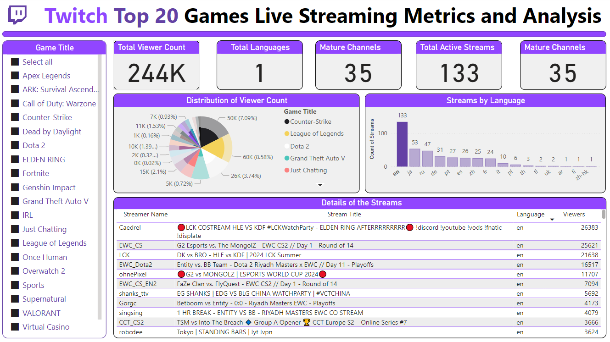

# Interactive Twitch Stream Analytics Dashboard

## Overview

Welcome to the Interactive Twitch Stream Analytics Dashboard project! This project leverages Power BI to analyze the top 20 games on Twitch, providing valuable insights through a combination of powerful visualizations and interactive features.

## Project Highlights

### Diverse Visualizations
- **Pie Charts**: Display the distribution of viewer counts across different games.
- **Bar Graphs**: Show the number of streams by language and other key metrics.
- **Detailed Tables**: Provide comprehensive insights into individual streams, streamers, and viewer engagement.

### Key Metrics
- **Total Viewers**: Track the overall viewer engagement for the top 20 games.
- **Active Streams**: Monitor the number of live streams.
- **Language Distribution**: Understand the distribution of streams across different languages.

### Interactive Slicers
- Enable dynamic data filtering for in-depth and customized analysis.

## Purpose

This dashboard is designed to:
- Examine viewer engagement.
- Explore language distribution.
- Understand the popularity of different games and streamers.
- Support data-driven decision-making.
- Optimize content strategies.
